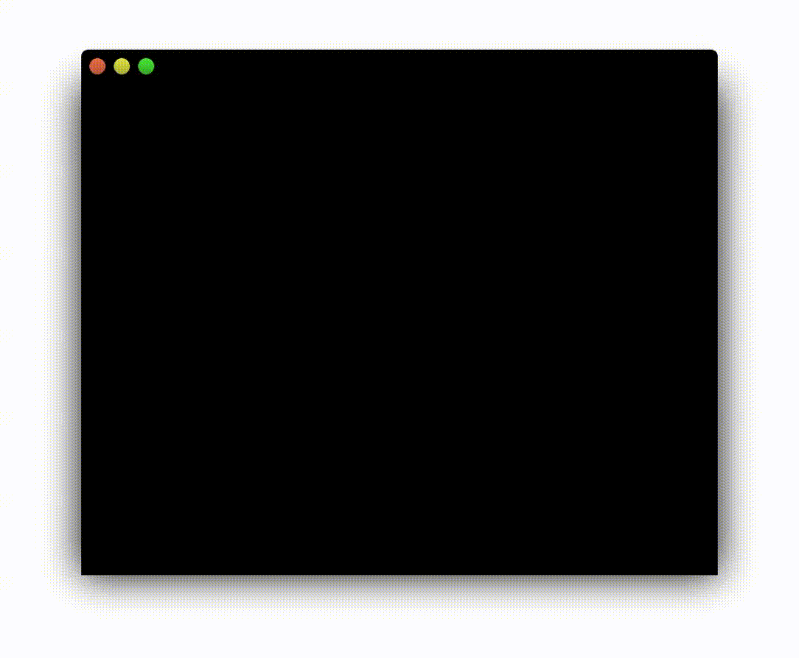
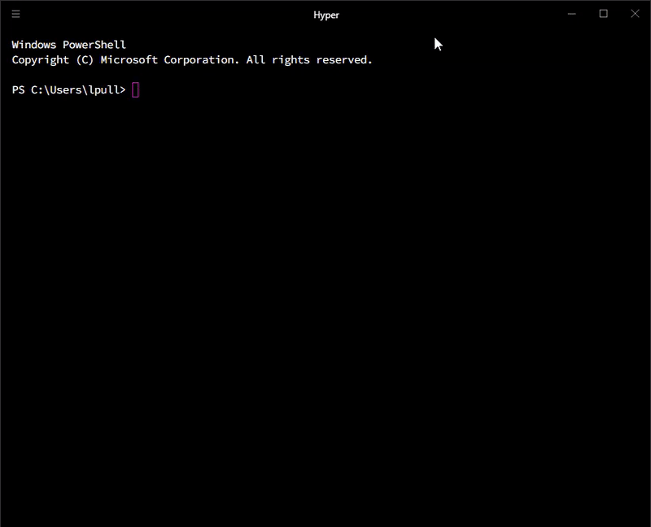

# Hyper-Orama
[](#contributors)

A screen recorder for the hyper terminal. It publishes all captured sessions to [now.sh](https://zeit.co/now)



## Setup

Clone the repository into `~/.hyper-plugins/local/`:

```bash
cd ~/.hyper-plugins/local/ # move into local plugin directory
git clone git@github.com:cwlowder/hyper-orama.git # clone repo
yarn # install dependencies
```

Your `~/.hyper.js` file should look like this:

```javascript
  // ...
  localPlugins: ['hyper-orama'],
  // ...
```

```bash
  yarn -g now # Install now
  now login # create and login into your now account
```

## Recording Videos

To start/stop recording:

* `Ctrl+Alt+R` (Windows/Linux)
* `Control+Option+R` (Mac).

After recording, the video will be processed and uploaded. The link will be copied to your clipboard, and a notification will appear in the lower right of the terminal.

The pulsing red light indicates recording in progress, and the white dot indicates upload in progress.



## Contributing

* _TODO_

## Contributors

Thanks goes to these wonderful people ([emoji key](https://github.com/all-contributors/all-contributors#emoji-key)):

<!-- ALL-CONTRIBUTORS-LIST:START - Do not remove or modify this section -->
<!-- prettier-ignore -->
| [<br /><sub><b>Tejas Kumar</b></sub>](https://twitter.com/tejaskumar_)<br />[📋](#eventOrganizing-tejasq "Event Organizing") [🤔](#ideas-tejasq "Ideas, Planning, & Feedback") [🚇](#infra-tejasq "Infrastructure (Hosting, Build-Tools, etc)") [👀](#review-tejasq "Reviewed Pull Requests") [⚠️](https://github.com/cwlowder/hyper-orama/commits?author=tejasq "Tests") |
| :---: |
<!-- ALL-CONTRIBUTORS-LIST:END -->

This project follows the [all-contributors](https://github.com/all-contributors/all-contributors) specification. Contributions of any kind welcome!